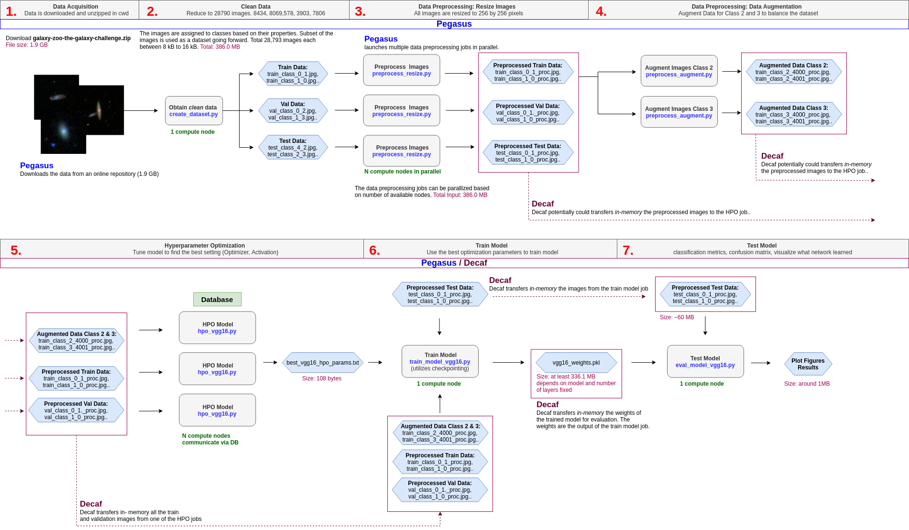

# Galaxy Classification Project

## For Testing

### Data

For first experiments I created a smaller dataset with 2500 images you can find in dev_galaxy_dataset/
The data is split into train, val and test sets vis prefixes (this is more natural for Pegasus)

For HPO we use:
train set with 1750 images
val set with 250 images

### Scripts

You need these scripts for the experiments

* model_selection.py - has definition of the pretrained model and early stopping modules
* data_loader.py  - custom dataset loader is defined here, HERE WE CACHE WHOLE DATASET IN MEMORY
* vgg16_hpo.py - experiment driver


RUN 

```python
python vgg16_hpo.py --trials 3 --epochs 10
```

The script creates a number of artifacts: checkpoints, plots and txt with best results.


RUN 

```python
python train_model.py --epochs 10
```


RUN 

```python
python eval_model.py 
```

```
CWD   (study object checkpoint and early stopping weights for all of the trials)
CWD   (here we get loss function plot and txt with best HPO from all trials)  
```


You do not need to create your own dataset. For dev dataset use dev_galaxy_dataset
for experiments on full dataset use full_galaxy_dataset

```
    
Galaxy Classification

optional arguments:
  -h, --help            show this help message and exit
  --batch_size BATCH_SIZE
                        batch size for training
  --cuda CUDA           use gpu support
  --seed SEED           select seed number for reproducibility
  --root_path ROOT_PATH
                        path to dataset
  --save SAVE           path to checkpoint save directory
  --epochs EPOCHS       number of training epochs
  --trials TRIALS       number of HPO trials                      (default: 2)

```

## General Instructions 
### Step 1: Download Dataset

https://www.kaggle.com/c/galaxy-zoo-the-galaxy-challenge

### Step 2: Run Dataset Generating Script

```python
python create_dataset.py
```
### Step 3: Split Dataset into Train, Test and Validation Set

```python
python split_data.py
```
### Step 4: Tune Model with Optuna

```python
python vgg16_hpo.py
```


### Decaf and Pegasus


### Confusion Matrix

